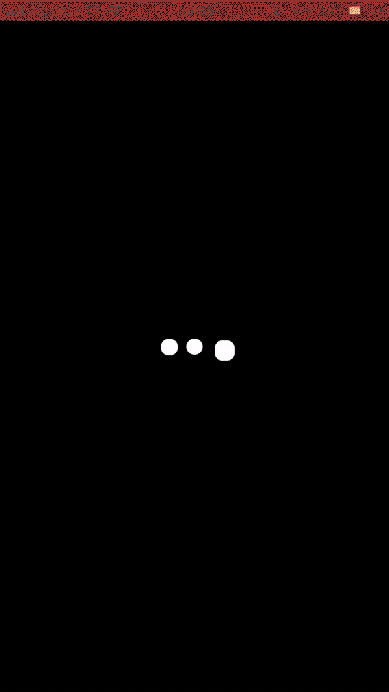

# SpotifyIndicator!

SpotifyIndicator is a  indicator activity . Similar to spotify activity indicator 




# Requirements

- iOS 9.0+
- Xcode 9.0
- Swift 4

# Installation


  ## Manually
  1. Download and drop ```SpotifyIndicator.swift``` in your project.  
  2. Congratulations!  


## Features

   ### The Basics
   
   ```swift
    let spotifyIndicator = SpotifyIndicator()
    spotifyIndicator.yourView      = self.view
    spotifyIndicator.yourViewAlpha = 1
    spotifyIndicator.show(shape:.circle) // or .square
   ```


## Release History

* 1.0
  first commit
  
